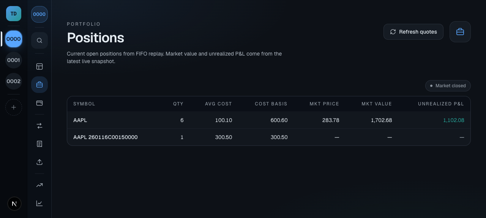
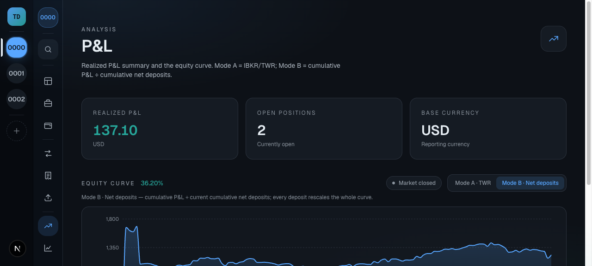
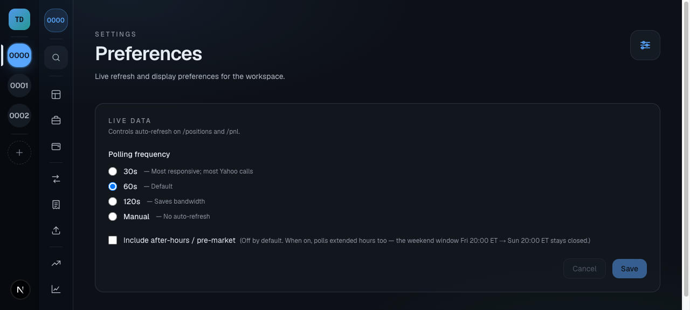

# Trading Tracking Dashboard

A personal trading-tracking dashboard — imports IBKR Daily Activity Statements,
computes positions & P&L, layers on market-data snapshots and an equity curve,
with realtime quotes and a BYOK AI/news layer planned.

**[English](#english) · [中文](#中文)**

## Screenshots

<table>
  <tr>
    <td width="33%"><strong>Positions</strong> — live polled prices, "Live · Ns ago" / "Market closed" badge</td>
    <td width="33%"><strong>P&amp;L</strong> — realized summary, equity curve, mode toggle, live tail update</td>
    <td width="33%"><strong>Settings / Preferences</strong> — polling frequency + after-hours toggle</td>
  </tr>
  <tr>
    <td></td>
    <td></td>
    <td></td>
  </tr>
</table>

---

## English

### Overview

Import IBKR statements → compute positions & P&L → market-data snapshots &
equity curve → (later) realtime quotes + BYOK AI analysis. Built in numbered
phases — see [Progress](#progress) below.

**Source of truth:** CSV ledgers under `backend/data/accounts/<id>/` are the
single source of truth (user-editable); the SQLite DB is a rebuildable query
projection. **USD is the canonical currency** — every record stores its
original currency + USD + the FX rate used.

### Architecture

- **Backend**: Python 3.12 + FastAPI + SQLAlchemy 2.0 + Alembic (uv-managed)
- **Frontend**: Next.js 16 (App Router) + React 19.2 + TypeScript + Tailwind v4
- **DB**: SQLite (local) → PostgreSQL (cloud); no code change to swap
- Two-part monorepo with no shared code — `backend/` and `frontend/` talk only over HTTP

Detailed roadmap: `~/.claude/plans/dashboard-traking-ibkr-daily-activity-s-squishy-bee.md`

### Quick start

Prerequisites: `node >= 20.9`, `python >= 3.12`, `uv`
(`curl -LsSf https://astral.sh/uv/install.sh | sh`).

```bash
make install          # install deps (uv sync + npm install)
make dev              # backend (:8000) + frontend (:3000) together
```

Open [http://localhost:3000](http://localhost:3000) — it redirects to `/dashboard`.
Use `localhost`, **not** `127.0.0.1` — Next.js 16's dev server blocks
cross-origin dev resources, which breaks hydration on `127.0.0.1`.

Run parts individually:

```bash
make dev-backend      # backend only — OpenAPI at http://localhost:8000/docs
make dev-frontend     # frontend only
make test             # pytest (backend)
make lint             # ruff (backend) + eslint (frontend)
```

### IBKR Client Portal Gateway (optional, realtime quotes)

Live polling upgrades from delayed Yahoo data to realtime IBKR quotes when
the IBKR Client Portal Gateway is running and logged in (requires Java 8+):

1. Download the [Client Portal Gateway](https://download2.interactivebrokers.com/portal/clientportal.gw.zip)
   and unzip it so that `gateway/clientportal.gw/bin/run.sh` exists.
2. `make gateway` — starts it on `https://localhost:5000`.
3. Open `https://localhost:5000` in a browser (accept the self-signed
   certificate) and log in with your IBKR credentials + 2FA.

The `/positions` and `/pnl` badges show the active source: `Live · IBKR`
(realtime, options priced at IBKR mark) or `Live · Yahoo (delayed)`
(fallback whenever the Gateway is down or logged out — options fall back
to cost). No configuration needed; the fallback is automatic.

### Project layout

```
backend/
  app/
    api/              # FastAPI routers (accounts, statements, health)
    core/             # settings
    db/               # SQLAlchemy models + Alembic
    services/
      parsers/        # IBKR Flex statement parsing
      ledger/         # CSV ledger subsystem (file-as-source-of-truth)
      projection/     # rebuild DB projection from the ledger
      fx/             # FX rates (ECB / Frankfurter)
      pnl/            # FIFO P&L engine + equity curve
      providers/      # market-data adapters (Yahoo)
      snapshot/       # rebuildable position snapshots
      news/           # BYOK news adapters (planned)
    mcp_server/       # AI tool layer — MCP + OpenAI function spec (planned)
  alembic/
frontend/
  app/(workspace)/    # Discord-style 3-rail workspace + pages
  lib/                # API client, formatters, account helpers
```

### Progress

#### ✅ Phase 0 — Scaffolding (2026-04-19)
FastAPI + SQLAlchemy + Alembic backend with a live `/health`; Next.js 16 +
React 19.2 + Tailwind v4 frontend; root `Makefile` runs both.

#### ✅ Phase 0.5 — Discord-style workspace shell (2026-04-19)
Twin-rail navigation — **AccountRail** (accounts-as-servers) + **ModuleRail**
(icon-only, hover tooltips). 14 sub-pages across Portfolio / Activity /
Analysis / Intelligence / Settings.

#### ✅ Phase 1 — Import + core data (2026-05-18, M1–M9)
- **M1** — 6-table schema (Account / Instrument / Trade / CashFlow /
  CorporateAction / PositionSnapshot) + Alembic migration
- **M2** — CSV ledger subsystem: file-as-source-of-truth, dedup-append
- **M3** — projection builder: rebuild the DB projection from the ledger (idempotent)
- **M4** — FX layer: original + USD + rate per record; ECB / Frankfurter fallback
- **M5** — P&L engine: FIFO matching, realized P&L, equity curve (Mode A = TWR,
  Mode B = cumulative P&L ÷ net deposits)
- **M6** — IBKR Flex Query CSV parser: multi-account, idempotent re-import
- **Phase 1.4** — market-data / snapshot layer: Yahoo Finance provider,
  rebuildable position snapshots, equity-curve feed
- **M8** — backend HTTP API: accounts / positions / trades / pnl / curve,
  statement upload, refresh-prices
- **M9** — frontend pages: `/upload`, `/positions`, `/trades`, `/pnl`
  (Recharts equity curve), DB-driven account rail

#### 🚧 Phase 2 — Realtime data (Milestones A & B done)
- **Milestone A** ✅ — Yahoo polling on `/positions` and `/pnl` (default 60s,
  configurable in `/settings/preferences`); pauses outside US market hours;
  `GET /accounts/{id}/live-snapshot` umbrella endpoint with strict failure
  semantics. Settings stored client-side in `localStorage`.
- **Milestone B** ✅ — IBKR Client Portal realtime quotes: chained provider
  (`IBKR CP > Yahoo`) behind `live-snapshot`, options priced at IBKR mark
  when the Gateway is up, silent fallback to delayed Yahoo otherwise;
  badge shows the active source. Positions reconciliation & order status
  deferred to later milestones.

#### 🔜 Phase 3 — Intelligence layer
BYOK AI tool layer (MCP server + OpenAI function spec), BYOK news providers
(Marketaux / Finnhub / Alpha Vantage).

#### 🔜 Phase 4 — Deployment
PostgreSQL migration, Docker containerization, cloud release.

---

## 中文

### 概述

个人交易追踪 dashboard:导入 IBKR Daily Activity Statement → 计算持仓与盈亏 →
行情快照与净值曲线 →(后续)实时报价 + BYOK AI 分析。按编号阶段推进 ——
见下方[进度](#进度)。

**真相源:** `backend/data/accounts/<id>/` 下的 CSV 账本是唯一真相源(用户可直接
编辑);SQLite 只是可重建的查询投影。**USD 为唯一规范货币** —— 每条记录都存
原币种 + USD + 所用汇率。

### 架构

- **后端**:Python 3.12 + FastAPI + SQLAlchemy 2.0 + Alembic(uv 包管理)
- **前端**:Next.js 16(App Router)+ React 19.2 + TypeScript + Tailwind v4
- **数据库**:SQLite(本地)→ PostgreSQL(云端),切换无需改代码
- 双端 monorepo,无共享代码 —— `backend/` 与 `frontend/` 只通过 HTTP 通信

详细路线图:`~/.claude/plans/dashboard-traking-ibkr-daily-activity-s-squishy-bee.md`

### 快速开始

前置:`node >= 20.9`、`python >= 3.12`、`uv`
(`curl -LsSf https://astral.sh/uv/install.sh | sh`)。

```bash
make install          # 装依赖(uv sync + npm install)
make dev              # 同时启动 backend (:8000) + frontend (:3000)
```

访问 [http://localhost:3000](http://localhost:3000),会重定向到 `/dashboard`。
请用 `localhost`,**不要**用 `127.0.0.1` —— Next.js 16 dev server 会拦截跨源
dev 资源,用 `127.0.0.1` 访问会导致前端无法 hydrate。

单独启动:

```bash
make dev-backend      # 仅后端 —— OpenAPI 在 http://localhost:8000/docs
make dev-frontend     # 仅前端
make test             # pytest(后端)
make lint             # ruff(后端)+ eslint(前端)
```

### IBKR Client Portal Gateway(可选,实时行情)

跑起并登录 IBKR Client Portal Gateway 后,轮询数据自动从 Yahoo 延迟价升级为
IBKR 实时价(需要 Java 8+):

1. 下载 [Client Portal Gateway](https://download2.interactivebrokers.com/portal/clientportal.gw.zip),
   解压到仓库根目录使 `gateway/clientportal.gw/bin/run.sh` 存在。
2. `make gateway` —— 启动在 `https://localhost:5000`。
3. 浏览器访问 `https://localhost:5000`(接受自签名证书),用 IBKR 账号 + 2FA 登录。

`/positions` 与 `/pnl` 的徽章会显示当前数据源:`Live · IBKR`(实时,期权按
IBKR mark 计价)或 `Live · Yahoo (delayed)`(Gateway 掉线/未登录时自动回落,
期权回落成本计价)。无需任何配置,回退全自动。

### 目录结构

```
backend/
  app/
    api/              # FastAPI 路由(accounts、statements、health)
    core/             # 配置
    db/               # SQLAlchemy models + Alembic
    services/
      parsers/        # IBKR Flex 对账单解析
      ledger/         # CSV 账本子系统(文件即真相源)
      projection/     # 从账本重建 DB 投影
      fx/             # 汇率(ECB / Frankfurter)
      pnl/            # FIFO 盈亏引擎 + 净值曲线
      providers/      # 行情 adapter(Yahoo)
      snapshot/       # 可重建的持仓快照
      news/           # BYOK 新闻 adapter(规划中)
    mcp_server/       # AI 工具层 —— MCP + OpenAI function spec(规划中)
  alembic/
frontend/
  app/(workspace)/    # Discord 风格三栏工作区 + 页面
  lib/                # API client、格式化、账户工具
```

### 进度

#### ✅ Phase 0 —— 脚手架(2026-04-19)
FastAPI + SQLAlchemy + Alembic 后端,`/health` 在线;Next.js 16 + React 19.2 +
Tailwind v4 前端;根 `Makefile` 同启两端。

#### ✅ Phase 0.5 —— Discord 风格工作区外壳(2026-04-19)
双栏导航 —— **AccountRail**(账户即 server)+ **ModuleRail**(纯图标、hover 出
tooltip)。Portfolio / Activity / Analysis / Intelligence / Settings 共 14 个子页面。

#### ✅ Phase 1 —— 导入 + 核心数据(2026-05-18,M1–M9)
- **M1** —— 6 张表(Account / Instrument / Trade / CashFlow /
  CorporateAction / PositionSnapshot)+ Alembic migration
- **M2** —— CSV 账本子系统:文件即真相源,去重追加
- **M3** —— projection builder:从账本全量重建 DB 投影(幂等)
- **M4** —— FX 层:每条记录存原币种 + USD + 汇率;ECB / Frankfurter 兜底
- **M5** —— P&L 引擎:FIFO 撮合、已实现盈亏、净值曲线(Mode A = TWR,
  Mode B = 累计盈亏 ÷ 累计净入金)
- **M6** —— IBKR Flex Query CSV 解析器:多账户,重复导入幂等
- **Phase 1.4** —— 行情 / 快照层:Yahoo Finance provider、可重建持仓快照、
  净值曲线数据源
- **M8** —— 后端 HTTP API:accounts / positions / trades / pnl / curve、
  对账单上传、刷新行情
- **M9** —— 前端页面:`/upload`、`/positions`、`/trades`、`/pnl`
  (Recharts 净值曲线)、账户栏 DB 驱动

#### 🚧 Phase 2 —— 实时数据(Milestone A、B 已完成)
- **Milestone A** ✅ —— `/positions` 与 `/pnl` 接 Yahoo 自动轮询(默认 60s,
  `/settings/preferences` 可调);盘外暂停;后端 `GET /accounts/{id}/live-snapshot`
  伞形接口,strict 失败语义。Settings 存浏览器 `localStorage`。
- **Milestone B** ✅ —— IBKR Client Portal 实时报价:live-snapshot 后面挂
  链式 provider(`IBKR CP > Yahoo`),Gateway 在线时期权按 IBKR mark 实时
  计价,掉线静默回落 Yahoo 延迟价;徽章显示当前数据源。持仓对账与订单状态
  留给后续里程碑。

#### 🔜 Phase 3 —— 情报层
BYOK AI 工具层(MCP Server + OpenAI function spec)、BYOK 新闻 provider
(Marketaux / Finnhub / Alpha Vantage)。

#### 🔜 Phase 4 —— 部署
PostgreSQL 迁移、Docker 容器化、云端发布。
